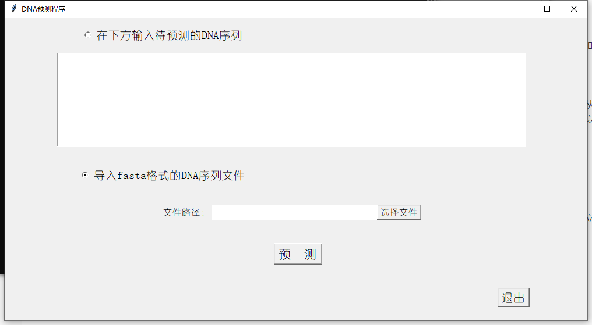
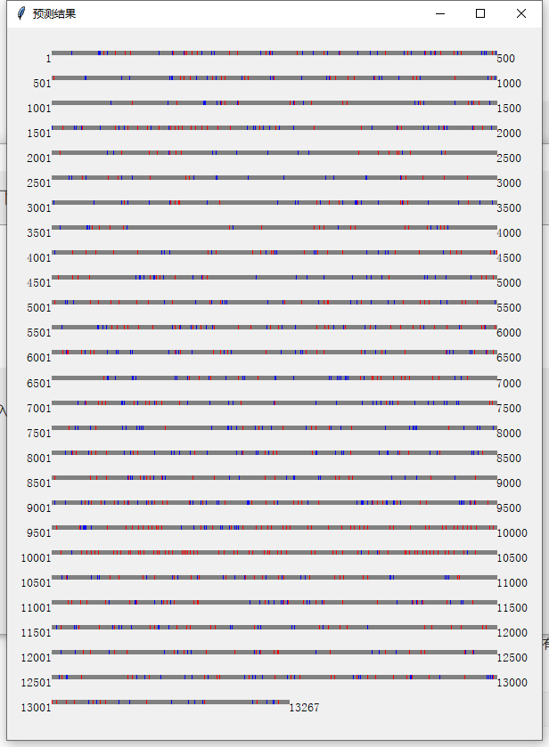
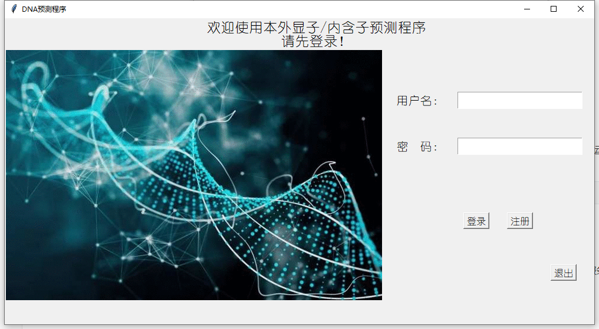
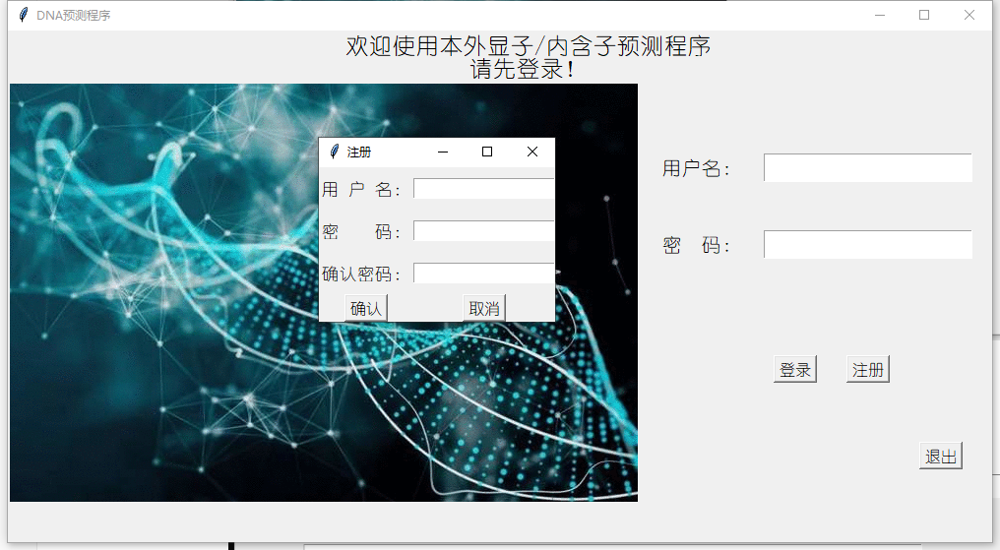

# Linux大作业程序说明文档

## DNA序列外显子/内含子预测程序

### 一、功能介绍

​        本小组筛选了多次机器学习的结果，采用准确率最高的模型，构建了一个用于预测一条DNA序列的外显子和内含子位置的可视化程序。

​        **用户可以采用以下两种方式输入带预测的序列（5'->3'）：**

- 直接在文本框内输入带预测的DNA序列，注意此处需要输入至少61bp的序列，否则模型预测会不够准确，从实际含义角度来说也没有什么意义。另外此处我们也只接受AGCT（大小写均可），出现其他字符程序会予以警告。
- 从您下载的fasta文件中导入序列



​        **结果如下（用于展示）：**

其中红色是EI位点，即exon->intron，是内含子的5'剪接位点；蓝色是IE，即intron->exon，是内含子的3'剪接位点；灰色即是普通碱基。蓝色/红色越聚集说明正确的可能性越大。

- 外显子为从蓝色聚集位置到红色聚集位置
- 内含子为从红色聚集位置到蓝色聚集位置




### 二、使用方法

#### 1. 打开程序

​        将[本小组Github主页](https://github.com/Fight-against-wmy/MachineLearning)中master分支的`app/exon_intron_predict`路径下所有文件下载到同一目录，然后运用以下命令运行。（需要您有Python3，和可支持tkinter的图形界面系统）

```bash
python3 main.py
```


#### 2. 登录界面

​        登录程序是考虑到安全性的问题，这个登录界面暂且以一个.passwd文件存储文件密码，后续改进可以用服务器保存账户密码。您可以注册用户密码，也可以使用默认的管理员登录（用户：admin，密码：admin）






#### 3. 预测界面

登录成功之后即可进入比对的界面，用前面功能介绍中介绍的方法即可运行。


